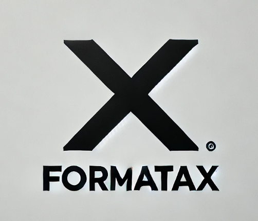
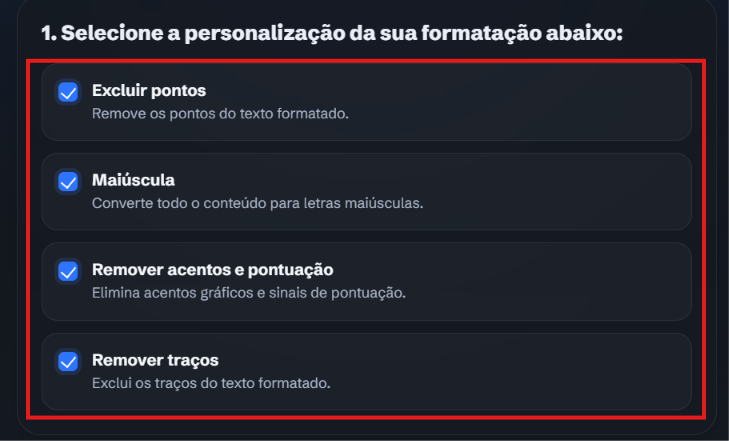
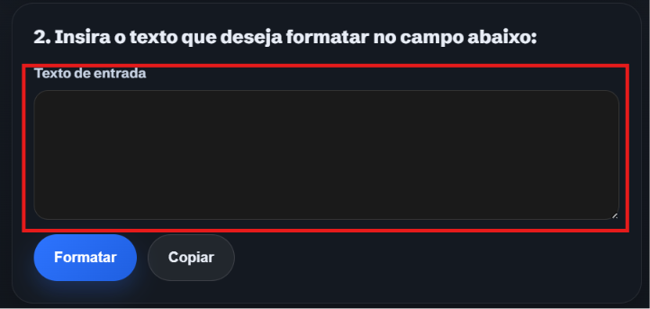
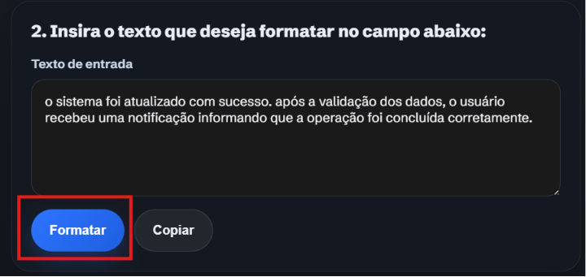
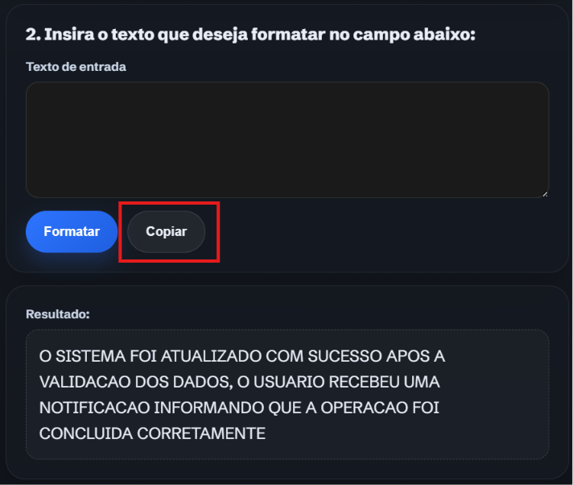
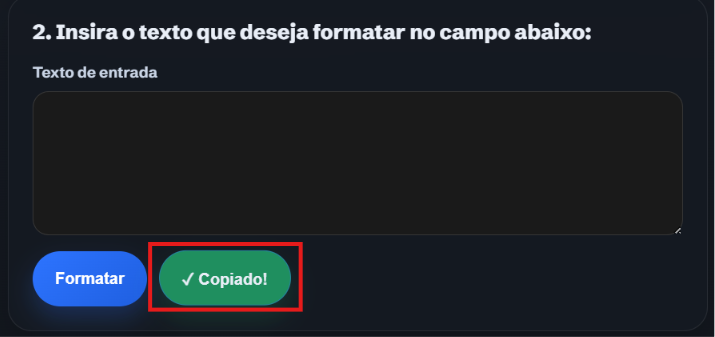

  

 

# FormataX

Ferramenta web para formatar textos com rapidez, clareza e controle total das regras aplicadas.

## Visão geral

O FormataX foi pensado para simplificar a padronização de textos em tarefas administrativas e rotinas de produtividade. Com uma interface direta e responsiva, você escolhe as regras, insere o conteúdo e obtém o resultado formatado em poucos segundos.

## Problema, solução e resultado

**Problema:** ajustar textos manualmente consome tempo, gera inconsistência e aumenta a chance de erro em tarefas repetitivas.

**Solução:** o FormataX centraliza regras de formatação em uma interface simples, permitindo combinar opções como remoção de pontos, traços, acentos e capitalização.

**Resultado:** o usuário ganha um fluxo mais rápido, previsível e visualmente claro para padronizar textos sem depender de edições manuais extensas.

## Como usar

<figure>
  
  <figcaption>Passo 1 — Escolha as regras de formatação nos cards</figcaption>
</figure>

<figure>
  
  <figcaption>Passo 2 — Cole o texto na área de entrada</figcaption>
</figure>

<figure>
  
  <figcaption>Passo 3 — Clique em "Formatar" para aplicar as regras</figcaption>
</figure>

<figure>
  
  
  <figcaption>Passo 4 — Use "Copiar" para enviar o resultado à área de transferência</figcaption>
</figure>

## Tecnologias

- HTML puro
- CSS puro
- JavaScript puro

## Estrutura

- [index.html](index.html)
- [styles/styles.css](styles/styles.css)
- [src/index.js](src/index.js)
- [src/format.js](src/format.js)

## Projeto online

Você também pode acessar a versão publicada em: [FormataX](https://guilherme-messias.github.io/formataX/)

## Contato

- Email: [messiasguilherme700@gmail.com](mailto:messiasguilherme700@gmail.com)
- GitHub: [guilherme-messias](https://github.com/guilherme-messias)
- LinkedIn: [Guilherme Messias](https://www.linkedin.com/in/guilhermemessiasdev/)
